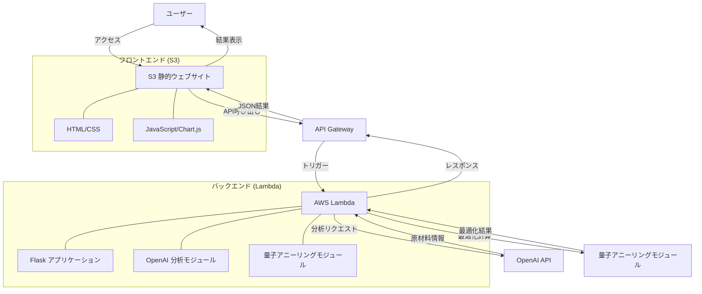

# 食品原材料最適化アプリケーション

量子アニーリングアルゴリズムとOpenAI APIを組み合わせた食品原材料最適化アプリケーションです。このアプリケーションは、AWS LambdaとS3を使用したサーバーレスアーキテクチャで構築されています。

## システムアーキテクチャ



## 機能

- OpenAI APIを使用して食品の原材料情報を分析
- 量子アニーリングアルゴリズムを使用して最適な配合比率を計算
- 目標栄養成分値（カロリー、タンパク質、脂質、炭水化物、塩分）に近づける最適化
- 結果をグラフと表で視覚的に表示

## プロジェクト構造

```
food-optimizer/
├── backend/
│   ├── app.py              # Flaskアプリケーション
│   ├── openai_analyzer.py  # OpenAI API関連の機能
│   ├── quantum_optimizer.py # 量子アニーリング関連の機能
│   ├── lambda_handler.py   # AWS Lambda用ハンドラー
│   ├── serverless.yml      # AWS Lambdaの設定
│   └── requirements.txt    # 依存関係
├── frontend/
│   ├── index.html          # メインページ
│   ├── styles.css          # スタイルシート
│   └── script.js           # フロントエンド機能
└── README.md               # プロジェクト説明
```

## 技術スタック

- バックエンド：Python、Flask、OpenAI API、dimod、neal（シミュレーテッドアニーリング）
- フロントエンド：HTML、CSS、JavaScript、Chart.js
- インフラ：AWS Lambda、S3、API Gateway

## 使用方法

1. 原材料リストをテキストボックスに入力します（例：「きなこ（大豆を含む）（国内製造）、水飴、砂糖」）
2. 目標栄養成分値を設定します（デフォルト値はきなこ飴の一般的な栄養成分値）
3. 「分析・最適化」ボタンをクリックします
4. 結果が表示されます：
   - 原材料の栄養成分情報
   - 最適な配合比率
   - 計算された栄養成分値
   - グラフによる視覚化
